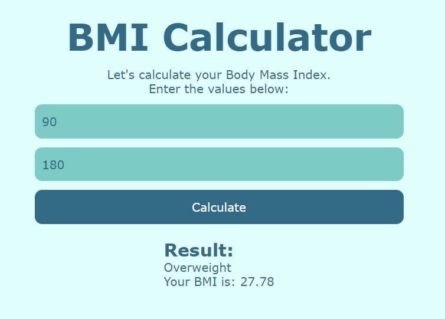
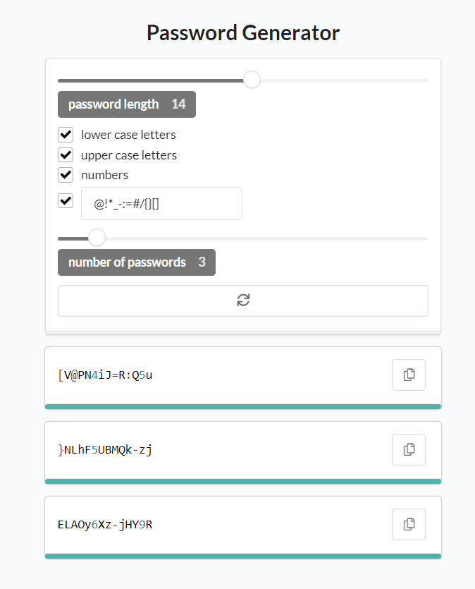

# react-projects
In this repository are stored React projects. They were created based on the tutorials on www.youtube.com

Main goal is to practice React.

Projects:
1. Bmi-calculator

2. Password-generator
